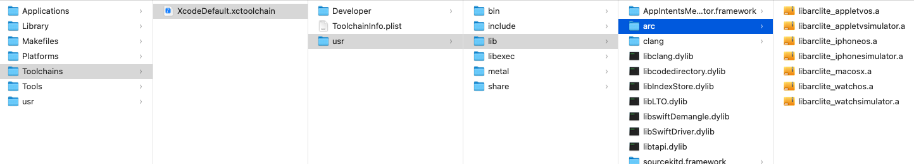
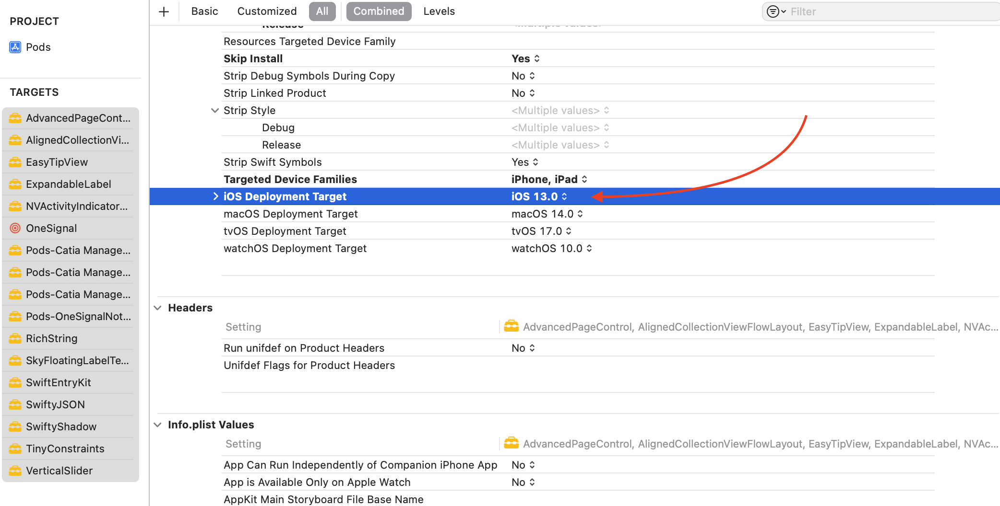

# Xcode libarclite


> 
clang: error: SDK does not contain 'libarclite' at the path '/Applications/Xcode.app/Contents/Developer/Toolchains/XcodeDefault.xctoolchain/usr/lib/arc/libarclite_iphonesimulator.a'; try increasing the minimum deployment target

There are three solutions


### Copy the missing files directly

Copy the entire arc directory into your new Xcode directory


```
/Applications/Xcode.app/Contents/Developer/Toolchains/XcodeDefault.xctoolchain/usr/lib/

```




### Change the iOS deployment target

The issue is with the minimum OS version on the Cocoapods project. Just go on your project navigator and select the pods project:

* Select all pods installed
* Change the iOS deployment target to at least iOS 13

It should work after that.



### Modify the podfile, if using XCode 15, iOS 17.0+

Apple staff mentions:


> libarclite was necessary for older OS versions, but is now obsolete. If you're encountering errors referring to this library, you should audit every target in your project for those that declare support for a minimum deployment target under iOS 11, and update them to at least iOS 11, or something more recent than that. You should not modify your Xcode installation to resolve this.


In podfile: add these lines at the end of the file. This will automatically change all pods targets to iOS 11 after running pod install. You don't have to select each target step by step.


```
post_install do |installer|
  installer.pods_project.targets.each do |target|
    target.build_configurations.each do |config|
      config.build_settings["IPHONEOS_DEPLOYMENT_TARGET"] = "11.0"
    end
  end
end
```


Good luck~

