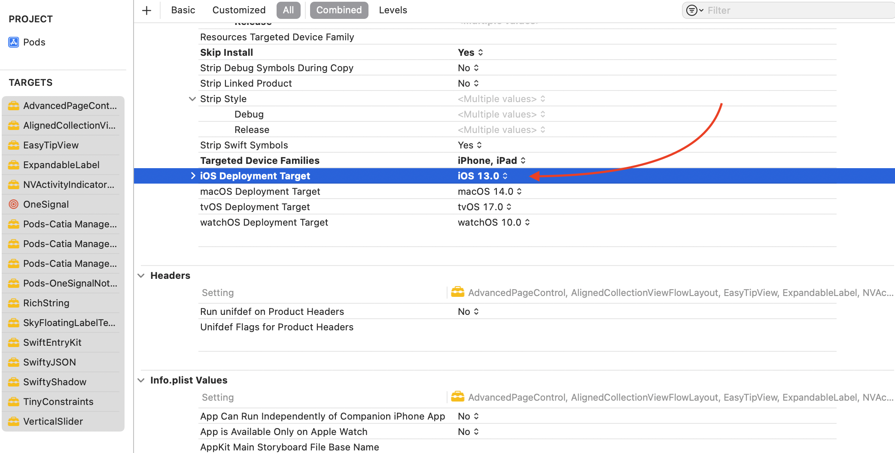
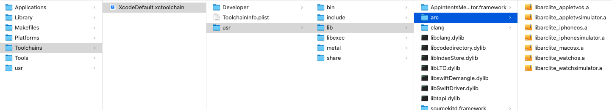

# Xcode libarclite Fix — `SDK does not contain 'libarclite'`

Fix for the **`clang: error: SDK does not contain 'libarclite'`** build error that appears in **Xcode 15 / Xcode 16** when building iOS apps with CocoaPods, Flutter, or React Native.

```
clang: error: SDK does not contain 'libarclite' at the path
'/Applications/Xcode.app/Contents/Developer/Toolchains/XcodeDefault.xctoolchain/usr/lib/arc/libarclite_iphonesimulator.a';
try increasing the minimum deployment target
```

> **Why this happens:** Apple removed `libarclite` from Xcode 15+. Any target (or Pod) that declares a **minimum deployment target below iOS 11** still tries to link it, and the build fails.

This repo gives you **three fixes** — pick the one that matches your situation.

---

## ✅ Fix 1 (Recommended): Bump the minimum deployment target

The cleanest fix. The error means *something* in your project still targets < iOS 11.

- **CocoaPods:** Open the **Pods** project → select all targets → set **iOS Deployment Target** to **iOS 12** or higher.
- **Your app:** In your main target's **Build Settings**, set **iOS Deployment Target** to **iOS 12+**.



---

## ✅ Fix 2: Auto-patch all Pods via Podfile

If you don't want to click through every Pod, add this to the **end of your `Podfile`**, then run `pod install`. It bumps every Pod target automatically:

```ruby
post_install do |installer|
  installer.pods_project.targets.each do |target|
    target.build_configurations.each do |config|
      config.build_settings["IPHONEOS_DEPLOYMENT_TARGET"] = "12.0"
    end
  end
end
```

> Apple's official guidance: *"libarclite was necessary for older OS versions, but is now obsolete. Audit every target for a minimum deployment target under iOS 11 and update them. You should not modify your Xcode installation to resolve this."*

---

## ✅ Fix 3 (Quick & dirty): Drop the missing `libarclite` files back in

When you **can't** change the deployment target (e.g. a locked old third-party SDK), restore the files Apple removed.

Copy the [`arc/`](arc/) directory from this repo into your Xcode toolchain:

```bash
sudo cp -R arc /Applications/Xcode.app/Contents/Developer/Toolchains/XcodeDefault.xctoolchain/usr/lib/
```



> ⚠️ This is a workaround, not a real fix — you'll need to re-copy after every Xcode update, and Apple recommends against it. Prefer Fix 1 or 2 when you can.

---

## Which fix should I use?

| Situation | Use |
|-----------|-----|
| You control the deployment target | **Fix 1** |
| Lots of CocoaPods dependencies | **Fix 2** |
| A locked old SDK forces < iOS 11 | **Fix 3** |

---

## Keywords

`libarclite` · `libarclite_iphonesimulator.a` · `SDK does not contain libarclite` · Xcode 15 · Xcode 16 · CocoaPods · Flutter · React Native · `IPHONEOS_DEPLOYMENT_TARGET` · iOS build error

---

⭐ **If this saved you time, please star the repo** — it helps others find the fix.
